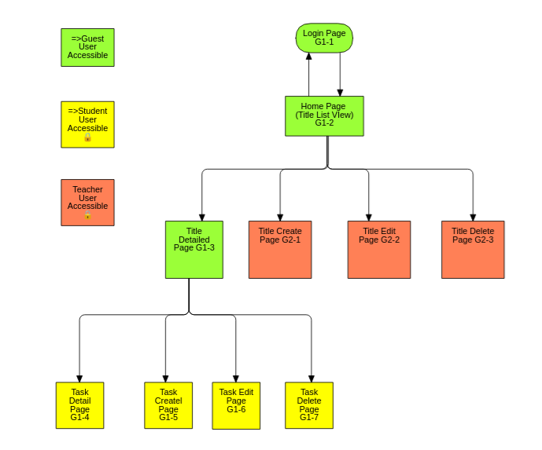

# Training Note Django Web-Application
## About
This is Training Note Management Web-Application built using Django and Bootstrap. 

##### [Installation](#installation)

##### [Site Map](#site-map)
##### [Roles Explained]()
- ##### [Admin]()
- ##### [Teacher]()
- ##### [Studnet]()
- ##### [Guest]()
----------
## Installation
This is installing and Deploying guide based on Ubuntu and Nginx Web server. By using unix web server gateway interface , Python and Web server can exchange data.  
#### Preparation
First, to host the deployment of this web-app, a working ubuntu linux server is needed(freshly installed 20.04 is recommanded).
1. Update the system and get required packages
   Update the system to make sure system is secure and repository is updated. 
   ``` bash
   sudo apt update
   sudo apt upgrade 
   ```
   Install Python3 and pip3 if not. 
   ```
   sudo apt install python3 python3-pip
   ```
2. Create and use Virtual environment
   
#### Getting Source 
#### Setting uWSGI
#### Configure Nginx Web Server
#### Connection Django, uWSGI and Nginx
#### Last Clean Up
## Site Map
This is the site map for TNM showing accessible pages based on roles distinguised by colors.


